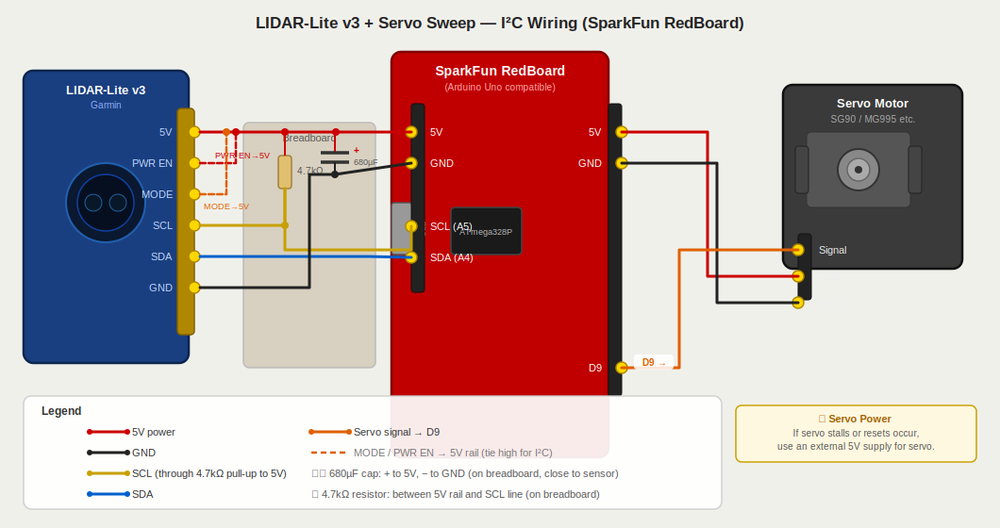

# Garmin LIDAR-Lite v3 — Arduino Sweep Mapper

A 180° distance sweep mapper using the Garmin LIDAR-Lite v3 on a servo, with a real-time radar display built in [Processing](https://processing.org).

---

## How it works

1. A servo sweeps the LIDAR-Lite v3 from 15° to 165° in 1° steps
2. The Arduino reads distance over I²C at each angle and streams `angle,distance` over Serial
3. The Processing app reads the serial data and renders a live phosphor-style radar map

---

## Hardware

| Component | Notes |
|---|---|
| SparkFun RedBoard (Arduino Uno) | Any Uno-compatible board works |
| Garmin LIDAR-Lite v3 | I²C mode |
| Servo motor | SG90, MG90S, MG995, etc. |
| 680µF electrolytic capacitor | Between 5V and GND, close to sensor |
| 4.7kΩ resistor | Pull-up on SCL line |
| Breadboard + jumper wires | |

---

## Wiring

### I²C + Servo (full setup)



| LIDAR-Lite v3 Pin | Wire | Connects to |
|---|---|---|
| 5V | Red | Arduino 5V |
| PWR EN | Red (dashed) | Arduino 5V (tie high) |
| MODE | Orange (dashed) | Arduino 5V (tie high) |
| SCL | Yellow | Breadboard → 4.7kΩ pull-up → Arduino SCL (A5) |
| SDA | Blue | Arduino SDA (A4) |
| GND | Black | Arduino GND |

| Servo Pin | Wire | Connects to |
|---|---|---|
| Signal | Orange | Arduino **D9** |
| VCC | Red | Arduino 5V *(see note)* |
| GND | Black | Arduino GND |

> **Power note:** The LIDAR draws up to 135mA and a servo up to 250mA — close to the Arduino's USB limit. If you see random resets, power the servo from an external 5V supply (shared GND with Arduino).

> **Pull-up note:** The 4.7kΩ resistor goes between the 5V rail and the SCL line on the breadboard. A second resistor on SDA is optional for short cable runs (the sensor's internal pull-ups handle it).

---

## Software

### Arduino — `arduino/LidarSweep/LidarSweep.ino`

**Libraries required** (install via Arduino Library Manager):
- `LIDARLite` by Garmin
- `Servo` (built-in)

Upload this sketch first. It sweeps the servo and streams `angle,distance\n` at 115200 baud.

**Tuning options** at the top of the sketch:

```cpp
const int STEP      = 1;   // degrees per step — use 2 for faster sweep
const int SETTLE_MS = 20;  // ms for servo to settle — increase if readings jump
```

### Processing — `processing/LidarMapper/LidarMapper.pde`

**Requires:** [Processing 4](https://processing.org/download)

Before running, set your Arduino's serial port at the top of the sketch:

```java
final String PORT_NAME = "/dev/cu.usbmodem14101";  // Mac
// final String PORT_NAME = "COM3";                // Windows
```

Run the sketch once without the port set — it will print all available ports to the console, then set `PORT_NAME` to the correct one.

**Display features:**
- Phosphor-green radar aesthetic
- Color-coded distance dots: 🔴 close → 🟡 mid → 🟢 far
- Sweep line with glow trail that follows direction
- Points fade over ~6 seconds of persistence
- Live angle + distance readout in HUD

---

## Repo structure

```
garmin-lidar-lite-v3/
├── arduino/
│   └── LidarSweep/
│       └── LidarSweep.ino      ← upload to Arduino
├── processing/
│   └── LidarMapper/
│       └── LidarMapper.pde     ← run in Processing 4
├── wiring_i2c_servo.svg        ← full wiring diagram (I²C + servo)
├── wiring_diagram.svg          ← original PWM wiring reference
└── README.md
```

---

## References

- [LIDAR-Lite v3 Operation Manual (Garmin)](https://static.garmin.com/pumac/LIDAR_Lite_v3_Operation_Manual_and_Technical_Specifications.pdf)
- [SparkFun LIDAR-Lite v3 Hookup Guide](https://learn.sparkfun.com/tutorials/lidar-lite-v3-hookup-guide)
- [Processing 4 Download](https://processing.org/download)
- [Arduino Servo Library](https://www.arduino.cc/reference/en/libraries/servo/)
