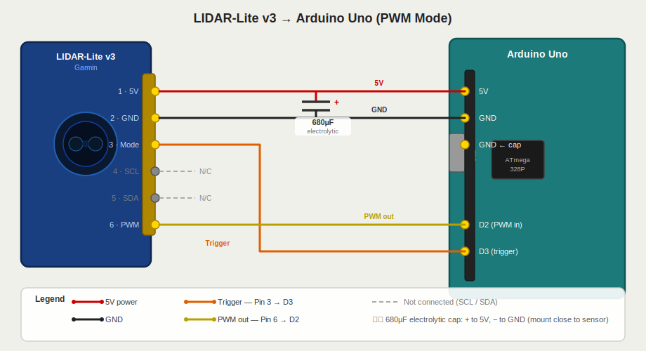

# Garmin LIDAR-Lite v3 — Arduino Uno (PWM Mode)

Wiring reference and Arduino sketch for the Garmin LIDAR-Lite v3 distance sensor using PWM mode (no library required).

## Wiring Diagram



## Pin Connections

| LIDAR-Lite v3 Pin | Label | Arduino Uno |
|---|---|---|
| 1 | 5V Power | 5V |
| 2 | Ground | GND |
| 3 | Mode Control (trigger) | D3 |
| 4 | SCL | Not connected |
| 5 | SDA | Not connected |
| 6 | PWM output | D2 |

> **Important:** Add a **680µF electrolytic capacitor** between 5V and GND as close to the sensor as possible. The v3 draws up to 135mA in bursts and will give erratic readings without it.

## How PWM Mode Works

- Pulse pin 3 (Mode) **HIGH** to trigger a measurement
- The sensor outputs a pulse on pin 6 where **1 µs = 1 cm**
- Read the pulse width with `pulseIn()` — no external library needed
- Allow ~22ms between measurements at full rate

## Arduino Sketch

```cpp
const int PIN_TRIGGER = 3;
const int PIN_PWM     = 2;

void setup() {
  pinMode(PIN_TRIGGER, OUTPUT);
  pinMode(PIN_PWM, INPUT);
  Serial.begin(115200);
}

void loop() {
  // Trigger a measurement
  digitalWrite(PIN_TRIGGER, HIGH);
  delayMicroseconds(10);
  digitalWrite(PIN_TRIGGER, LOW);

  // Read pulse width — timeout at 20ms (max range ~1000 cm)
  unsigned long pulse_us = pulseIn(PIN_PWM, HIGH, 20000UL);

  if (pulse_us == 0) {
    Serial.println("No signal / out of range");
  } else {
    Serial.print("Distance: ");
    Serial.print(pulse_us);   // 1 µs ≈ 1 cm
    Serial.println(" cm");
  }

  delay(100);
}
```

## Notes

- `pulseIn()` is blocking. For non-blocking reads, use an interrupt on D2 (INT0) and capture `micros()` on rising/falling edges.
- An optional 1kΩ pull-down resistor on pin 6 (PWM → GND) helps keep the line stable between measurements.
- If powering other devices from the Arduino 5V rail, consider an external 5V supply (shared GND) to avoid brownouts.

## References

- [LIDAR-Lite v3 Datasheet (Garmin)](https://static.garmin.com/pumac/LIDAR_Lite_v3_Operation_Manual_and_Technical_Specifications.pdf)
- [Arduino pulseIn() reference](https://www.arduino.cc/reference/en/language/functions/advanced-io/pulsein/)
